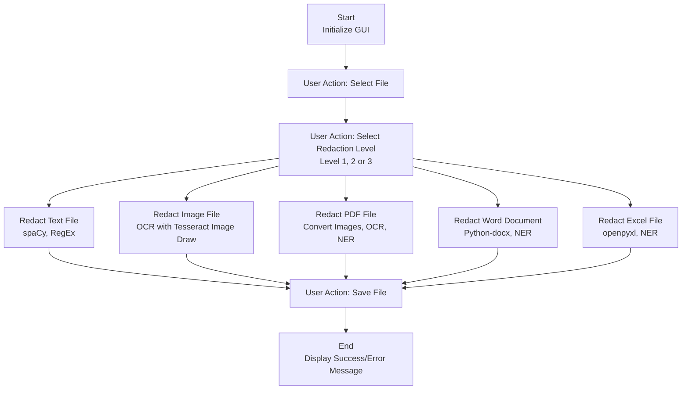

# RE-DACT: Advanced Document Redaction Tool

RE-DACT is a powerful, user-friendly document redaction tool designed by **Team Rookie** to protect sensitive information in various document formats. With its modern interface and comprehensive feature set, it provides an efficient way to redact personal information, business data, and other sensitive content.

## Features

### Core Functionality
- **Multi-Format Support**
  - Text files (.txt)
  - Word documents (.docx)
  - Excel spreadsheets (.xlsx)
  - PDF files (.pdf)
  - Images (.jpg, .jpeg, .png, .bmp, .gif, .tiff)

### Redaction Levels
1. **Basic (Level 1)**
   - Person names
   - Basic identifiers

2. **Intermediate (Level 2)**
   - Names
   - Organizations
   - Locations
   - Email addresses
   - Phone numbers

3. **Advanced (Level 3)**
   - All identifiers from levels 1 & 2
   - Social Security Numbers
   - Credit Card Numbers
   - Bank Account Numbers
   - IP Addresses
   - URLs
   - Dates
   - Custom patterns

### Advanced Features
- **Preview Mode**: Preview redactions before saving
- **Batch Processing**: Process multiple files at once
- **Custom Patterns**: Add your own redaction patterns
- **Dark/Light Theme**: Toggle between dark and light modes
- **Progress Tracking**: Real-time progress indication
- **Undo/Redo**: Track and reverse changes
- **Settings Persistence**: Save and restore user preferences

## Workflow

The following diagram illustrates the complete workflow of the RE-DACT tool:



This workflow demonstrates how RE-DACT handles different file types and processes them through appropriate redaction pipelines based on the selected redaction level.

## Installation

### Prerequisites
- Python 3.6 or higher
- Tesseract OCR

### Step 1: Clone the Repository
```bash
git clone https://github.com/yourusername/re-dact.git
cd re-dact
```

### Step 2: Install Dependencies
```bash
pip install -r requirements.txt
```

### Step 3: Install Tesseract OCR
- **Windows**:
  1. Download installer from [Tesseract GitHub](https://github.com/UB-Mannheim/tesseract/wiki)
  2. Run the installer
  3. Add Tesseract to system PATH

- **Linux**:
  ```bash
  sudo apt-get install tesseract-ocr
  ```

- **macOS**:
  ```bash
  brew install tesseract
  ```

### Step 4: Install Language Model
```bash
python -m spacy download en_core_web_sm
```

## Usage

### Basic Usage
1. Launch the application:
   ```bash
   python redact_tool.py
   ```

2. Select a file using the "Browse" button
3. Choose redaction level (Basic, Intermediate, or Advanced)
4. Click "Preview" to see the results (optional)
5. Click "Redact" to process the file

### Batch Processing
1. Click "File" → "Batch Process"
2. Select a folder containing files to process
3. Choose output location
4. All supported files will be processed automatically

### Custom Patterns
1. Click "Edit" → "Add Custom Pattern"
2. Enter pattern name and regular expression
3. New pattern will be applied in subsequent redactions

### Theme Customization
- Click "View" → "Toggle Theme" to switch between light and dark modes

## Security Features

### Pattern Detection
- Email addresses
- Phone numbers
- Social Security Numbers
- Credit card numbers
- Bank account numbers
- Physical addresses
- IP addresses
- URLs
- Dates
- Custom patterns

### Data Protection
- Original files are never modified
- Secure overwriting of sensitive information
- Logging of all redaction activities
- Error handling and validation

## Troubleshooting

### Common Issues
1. **Tesseract not found**:
   - Ensure Tesseract is installed
   - Verify PATH environment variable

2. **File Processing Errors**:
   - Check file permissions
   - Verify file format compatibility
   - Ensure sufficient disk space

3. **Performance Issues**:
   - Reduce image size for large files
   - Use batch processing for multiple files
   - Close other resource-intensive applications

## Contributing

We welcome contributions! Please follow these steps:

1. Fork the repository
2. Create a feature branch
3. Commit your changes
4. Push to the branch
5. Create a Pull Request

## License

This project is licensed under the MIT License - see the [LICENSE](LICENSE) file for details.

## Acknowledgments

- spaCy for NLP capabilities
- Tesseract for OCR functionality
- Python community for various libraries

## Support

For support, please:
1. Check the troubleshooting guide
2. Review existing issues
3. Create a new issue with detailed information

## Research Documentation

For a comprehensive market analysis of existing redaction tools and their limitations, please refer to our [Market Research Document](https://tinyurl.com/Team-Rookie-Research). This document provides detailed comparisons of current redaction tools in the market, their shortcomings, and how RE-DACT addresses these limitations.

## Contributors

* Kushal Parihar ([@switch41](https://github.com/switch41))
* Lewis Ronith Dhanraj ([@Ronith05](https://github.com/Ronith05))
* Sahithya Chandana ([@switch41](https://github.com/switch41))
* Nandikanti Sriya ([@nandikanti09](https://github.com/nandikanti09))
* O.K.Sree Vardhan ([@svardhan05](https://github.com/svardhan05))
* Pilla Varshith ([@Varshith35](https://github.com/Varshith35))
---

Made by Team Rookie

 
